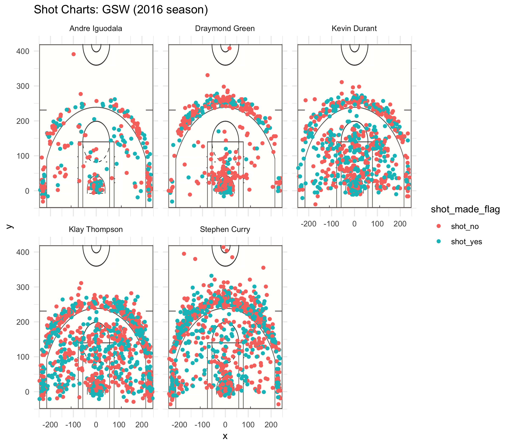

# ---
# title: "Workout01-sharene-siddiqui"
# author: "Sharene Siddiqui"
# date: "3/2/2019"
# output: github_document
# ---

```{r out.width='80%', echo=FALSE, fig.align='center'}

```

```{r, echo=FALSE}
library(readr)
library(dplyr)

shots_data <- read_csv('../data/shots-data.csv')

two_pt <- summarize(
group_by(filter(shots_data, shot_type == "2PT Field Goal"), name), total = n(), made = sum(shot_made_flag == "shot_yes"), perc_made = made/total*100)
two_pt <- arrange(two_pt, desc(perc_made))
two_pt

three_pt <- summarize(
group_by(filter(shots_data, shot_type == "3PT Field Goal"), name), total = n(), made = sum(shot_made_flag == "shot_yes"), perc_made = made/total*100)
three_pt <- arrange(three_pt, desc(perc_made))
three_pt

effective_shooting <- summarize(
group_by(shots_data, name), total = n(), made = sum(shot_made_flag == "shot_yes"), perc_made = made/total*100)
effective_shooting <- arrange(effective_shooting, desc(perc_made))
effective_shooting
```


## THE WARRIORS TALK A BIG GAME, BUT DO THEY PLAY ONE?  
By: Sharene Siddiqui  

Y'all saw that right? We killed it. The Golden State Warriors ended the 2016-2017 NBA season with the erecting of a certain finger towards the Cleveland Cavaliers. And thus began MAJOR bandwaggoning for the West's favorite team.  

But how did the season end on such a high note? We are interested in analyzing some statisitics for five Warrior players: Andre Iguodala, Draymond Green, Kevin Durant, Klay Thompson, and Stephen Curry. 

You know that player that essentially keeps the entire team together? That's Andre Iguodala for you. The Warrior's poster child attempted a mere 371 shots in the entire season, but made 192 of those, resulting in a true shooting percentage of 51.752%. This is the second best of the five players we analyzed.  

Best known for crying in the parking lot while begging Kevin Durant to join the team, meet Draymond Green. The defense God didn't play as impressively on offense, but no one could get past him. Green's shooting average was a couple points lower than the other top five Warrior players at 42.387%.  

Kevin Durant signed as a free agent in the summer of 2016 and made his generous salary well-worth it. With his help, the Warriors ended the season with a whopping one loss, despite LeBron James's best efforts. Durant put up a fight, scoring 30 or more points every game, with a shooting average of 54.098% and was named the NBA Finals MVP.  

You would think that Durant's addition to the roster would have slowed down other players' offensive game, but Klay Thomspon just proved you wrong. Thompson's true shooting percentage of 47.131% was consistent with the year prior. 

The Warriors became what it is today partly because of Stephen Curry. He didn't shoot three-pointers as well as fans are accustomed to, partly because of Durant's arrival on the team. Out of the 1250 attempted shots, he made 584, resulting in a shooting percentage of 46.72%. 

  


